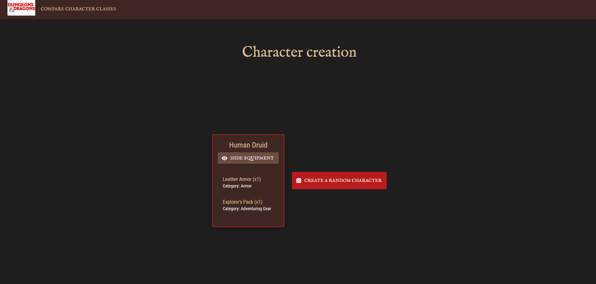
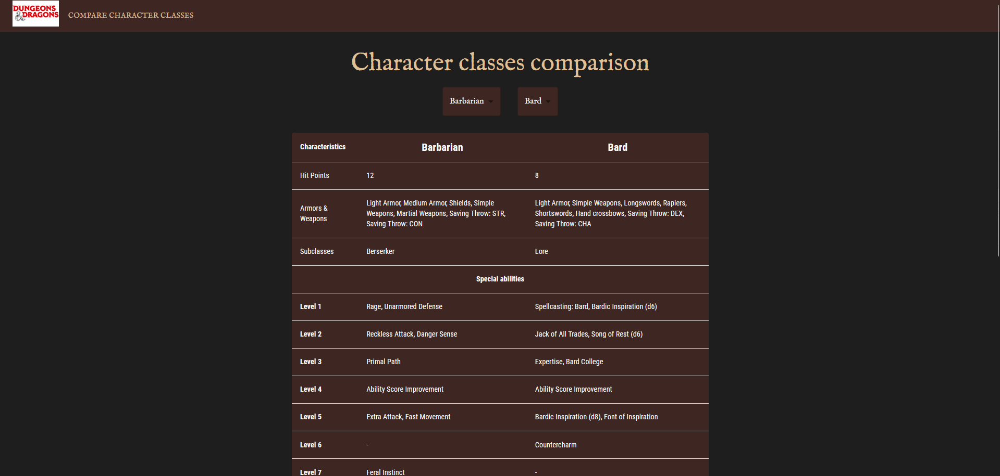

# 🏰 Dungeon & Dragons

Le déploiement continu est une pratique de développement logiciel où les modifications du code sont automatiquement testées et déployées en production sans intervention humaine, permettant ainsi une livraison rapide et fiable des nouvelles fonctionnalités aux utilisateurs.

Dans le cadre du cours sur le déploiement continu suivi à l'IMT Mines Alès, notre binôme avons développé l'application "Dungeon & Dragons". Ce projet consistait notamment à créer une application web avec un front end et un back end, avec pour principal objectif de mettre en place la conteneurisation et un déploiement continu en automatisant l'intégration via GitHub Actions.

## Fonctionnalités

- 🎢 **Obtenir un personnage aléatoire**
- ⚔️ **Comparer deux classes**

L'API [DnD 5e](https://www.dnd5eapi.co/) a été utilisée pour récupérer les données des personnages, des classes et des équipements, permettant ainsi à l'application d'offrir des informations dynamiques et actualisées sur les personnages et leurs caractéristiques. Cette API est interrogeable via des requêtes HTTP pour obtenir des données telles que les races, les classes et les équipements disponibles dans le jeu de rôle Dungeons & Dragons 5e.

---

## Installation

### Prérequis

Avant de commencer, assurez-vous d'avoir installé les outils suivants :

- **Node.js** : [Télécharger Node.js](https://nodejs.org/)
- **Docker** : [Télécharger Docker](https://www.docker.com/get-started)
- **Docker Compose** : [Télécharger Docker Compose](https://docs.docker.com/compose/install/)

### Cloner le projet

```bash
git clone https://github.com/MagicIrfan/projet-cicd.git
```

### Lancer avec Docker Compose

```bash
cd projet-cicd
docker-compose up --build
```

Le backend est disponible à l'adresse ```http://localhost:8080/``` <br/>
Le frontend est disponible à l'adresse ```http://localhost:5173/```

### Lancer les tests

#### Backend
  - Construire le backend :
    ```bash
    cd backend
    npm install
    npm run build
    ```
  - Executer les tests :
    ```bash
    npm run test
    ```
    
#### Frontend (avec Cypress) 
  - Construire le frontend :
    ```bash
    cd frontend
    npm install
    npm run build
    ```
  - Lancer le frontend :
    ```bash
    npm run dev
    ```
  - Exécuter Cypress :
    ```bash
    npx cypress open
    ```

---

## Endpoints

| Méthode | Route                 | Description                                | Réponse attendue                                                                                                                                                                                                                                      |
|---------|----------------------|----------------------------|-------------------------------------------------------------------------------------------------------------------------------------------------------------------------------------------------------------------------------------------------------|
| **GET** | `/characters/random` | Récupère un personnage aléatoire | `{ "race": "Human", "class": "Wizard", "equipments": [ { "name": "Sword", "quantity": 1, "category": "Weapon" }, { "name": "Shield", "quantity": 1, "category": "Armor" }, { "name": "Potion", "quantity": 3, "category": "Consumable" } ] }`         |
| **GET** | `/classes/compare?class1=warrior&class2=wizard` | Compare deux classes et retourne leurs caractéristiques | `{ class1: { name: "Warrior", hitPoints: 12, ... }, class2: { name: "Wizard", hitPoints: 6, ... } }`                                                                                                                                                  |
| **GET** | `/classes` | Liste les noms des classes disponibles | `["Warrior", "Wizard", "Rogue", "Cleric"]`                                                                                                                                                                                                            |

---

## Gestion des erreurs

| Cas d'erreur | Code HTTP | Réponse attendue |
|-------------|----------|----------------|
| Erreur interne | `500` | `{ "error": "Internal server error" }` |
| Comparaison de classes sans paramètre | `400` | `{ "error": "Two classes must be specified." }` |
| Classe introuvable | `404` | `{ "error": "Class not found: NomClasse" }` |
| Données invalides depuis l’API externe | `500` | `{ "error": "Invalid data format received from /api/classes" }` |

---

## Technologies utilisées

- **Backend** : Node.js + Express, Disponible au port `8080`
- **Frontend** : React + Vite, Disponible au port `5173`
- **Tests** : Jest côté back et Cypress coté front
- **API utilisée** : [DnD 5e API](https://www.dnd5eapi.co/)
- **CI/CD** : GitHub Actions
- **Containerisation** : Docker

---

## Visuel

### Générateur de personnage aléatoire

### Comparateur de classes


---

## Auteurs

Irfan BOUHENAF et Rayan BELKESSAM


